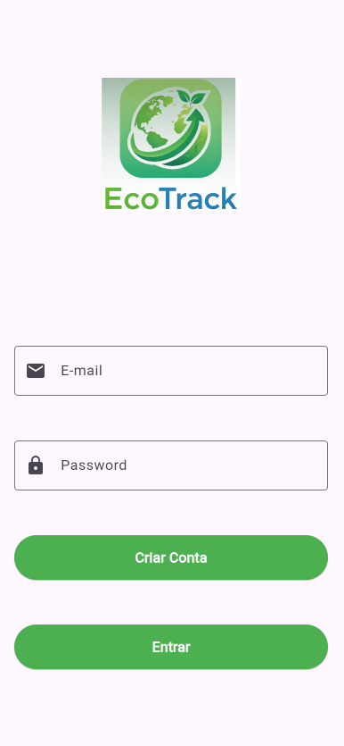
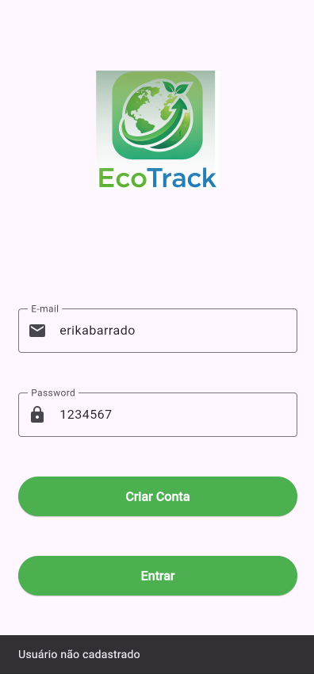
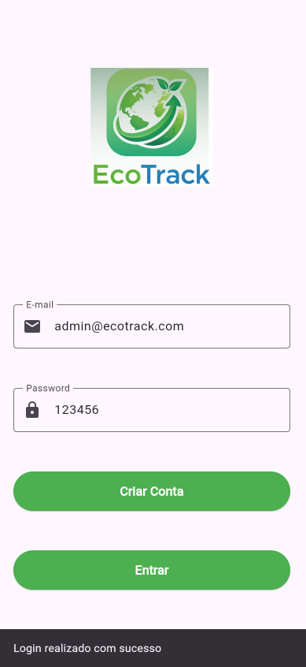
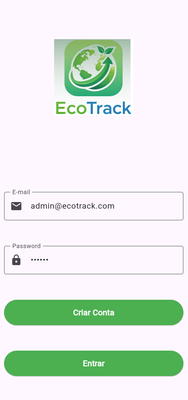

# Criar de Usuário

A tela de login está criada, agora precisamos validar o e-mail e senha do usuário.



Para validar o usuários crie um arquivo na pasta `services`, com nome `auth_service.dart`

## Criar Classe `AuthService`

```dart
class AuthService {

  final String usuarioCadastrado = "admin@ecotrack.com";
  final String senhaCadastrada = "123456";

  String? login(String email, String senha) {

    if (email.isEmpty || senha.isEmpty) {
      return "Preencha usuário e senha";
    }

    if (email != usuarioCadastrado) {
      return "Usuário não cadastrado";
    }

    if (senha != senhaCadastrada) {
      return "Usuário ou senha incorretos";
    }

    return null; // login correto
  }

}
```

## Chamar tela `login.dart`

```dart
import '../services/auth_service.dart';
```

### Criar o serviço dentro da classe

Dentro de _LoginScreenState crie uma variável final do tipo `AuthService`

```dart
final AuthService authService = AuthService();
```

### Criar função de validação

Ainda dentro da classe:

```dart
void validarLogin(){

  String email = emailController.text;
  String senha = senhaController.text;

  String? resultado = authService.login(email, senha);

  if(resultado != null){

    ScaffoldMessenger.of(context).showSnackBar(
      SnackBar(content: Text(resultado))
    );

  }else{

    ScaffoldMessenger.of(context).showSnackBar(
      SnackBar(content: Text("Login realizado com sucesso"))
    );

  }

}
```
### Alterar botão ENTRAR

```dart
onPressed: (){
  validarLogin();
},
```

## Relizar Teste






## Ocultar senha

No widget `TextField`do campo `Password` adicione a propriedade: `obscureText: true`

```dart
TextField(
              obscureText: true,
              controller: senhaController,
              decoration: InputDecoration(
                labelText: 'Password',                
                prefixIcon: Icon(Icons.lock),
                border: OutlineInputBorder(),
              ),
            ),
```



## Criar símbolo para ocultar e mostrar senha

Dentro da classe `_LoginScreen`, adicione uma variável: 

```dart
bool ocultarSenha = true;
```
---

```dart
TextField(
  controller: senhaController,
  obscureText: ocultarSenha,
  decoration: InputDecoration(
    labelText: 'Password',
    prefixIcon: Icon(Icons.lock),
    border: OutlineInputBorder(),
    
    suffixIcon: IconButton(
      icon: Icon(
        ocultarSenha ? Icons.visibility : Icons.visibility_off
      ),
      onPressed: (){
        setState(() {
          ocultarSenha = !ocultarSenha;
        });
      },
    ),
  ),
),
```

| Propriedade | Função                    |
| ----------- | ------------------------- |
| controller  | controla o texto digitado |
| obscureText | oculta a senha            |
| decoration  | estilo do campo           |
| labelText   | rótulo do campo           |
| prefixIcon  | ícone inicial             |
| suffixIcon  | ícone final               |
| border      | borda do campo            |
| onPressed   | ação do botão             |
| setState    | atualiza a tela           |


## Mensagem de Valiação abaixo dos campos e em vermelho

Para trocar a mensagem de validação dos campos para abaixo dos campos, precisamentos envolver todos os componentes em um `Form`

```dart
Form(
    key: _formKey,
    child:Column(
        children:
    ]
  )
```

## Campo de E-mail com validação automática

Troque `TextField`por `TextFormField`

```dart
TextFormField(
  controller: emailController,
  decoration: InputDecoration(
    labelText: 'E-mail',
    prefixIcon: Icon(Icons.email),
    border: OutlineInputBorder(),
  ),

  validator: (value){

    if(value == null || value.isEmpty){
      return "Digite seu e-mail";
    }

    if(!value.contains("@") || !value.contains(".")){
      return "E-mail inválido";
    }

    return null;
  },
),
```
## Campo de senha com erro abaixo

```dart
TextFormField(
  controller: senhaController,
  obscureText: true,
  decoration: InputDecoration(
    labelText: 'Password',
    prefixIcon: Icon(Icons.lock),
    border: OutlineInputBorder(),
  ),

  validator: (value){

    if(value == null || value.isEmpty){
      return "Digite sua senha";
    }

    if(value.length < 6){
      return "Senha deve ter no mínimo 6 caracteres";
    }

    return null;
  },
),
```

## Alterando metodo `validar`

```dart
void validarLogin() {

  if (_formKey.currentState!.validate()) {

    String email = emailController.text;
    String senha = senhaController.text;

    String? resultado = authService.login(email, senha);

    if (resultado != null) {

      ScaffoldMessenger.of(context)
          .showSnackBar(SnackBar(content: Text(resultado)));

    } else {

      ScaffoldMessenger.of(context)
          .showSnackBar(SnackBar(content: Text("Login realizado")));

    }

  }

}
```